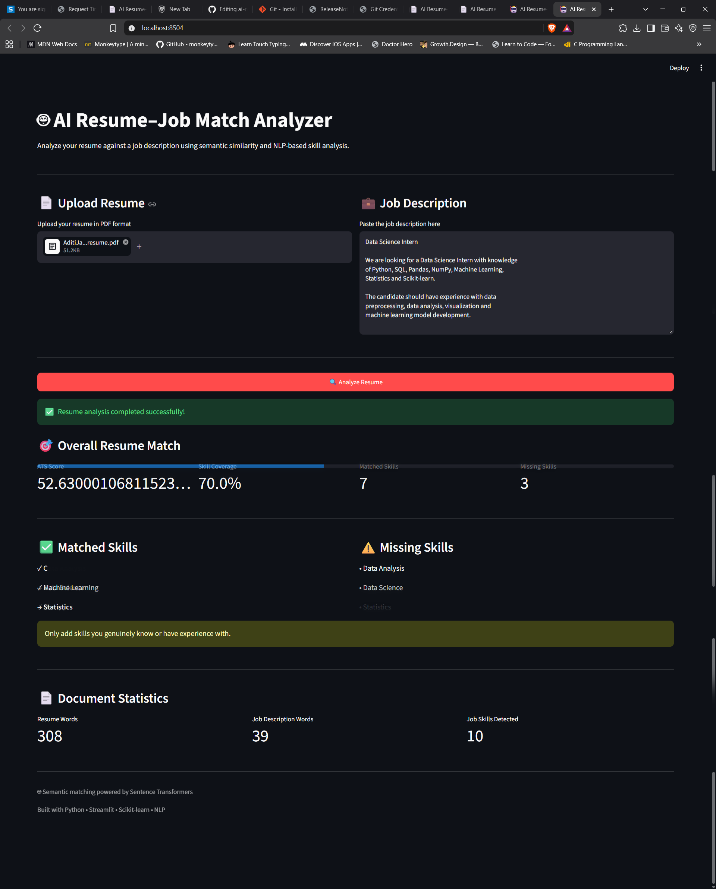

# 🤖 AI Resume–Job Match Analyzer

An NLP-powered web application that analyzes how well a candidate's resume matches a given job description using **Sentence Transformers, semantic embeddings, cosine similarity, and automated skill analysis**.

The application helps candidates identify their strengths, missing skills, and areas where their resume can be improved for a specific job role.

---

## 📸 Application Preview



---

## 🚀 Features

- 📄 Upload resume in PDF format
- 💼 Paste any job description
- 🧠 Semantic resume-job similarity using Sentence Transformers
- 📊 Resume Match Score
- 🎯 Skill matching between resume and job description
- ⚠️ Missing skill detection
- 💡 Resume improvement suggestions
- 📈 Resume and job description statistics
- 🖥️ Interactive Streamlit interface
- ⚡ Fast local processing

---

## 🧠 How It Works

The application follows an NLP-based pipeline:

```text
Resume PDF
     │
     ▼
PDF Text Extraction
     │
     ▼
Text Preprocessing
     │
     ▼
Sentence Transformer
     │
     ▼
Resume Embedding
     │
     ├───────────────┐
     │               │
     ▼               ▼
Resume Vector    Job Description
                     │
                     ▼
              Job Embedding
                     │
                     ▼
          Cosine Similarity
                     │
                     ▼
             Match Score
                     │
                     ▼
       ┌─────────────┴─────────────┐
       │                           │
       ▼                           ▼
  Skill Analysis            Recommendations
       │
       ├── Matched Skills
       │
       └── Missing Skills
